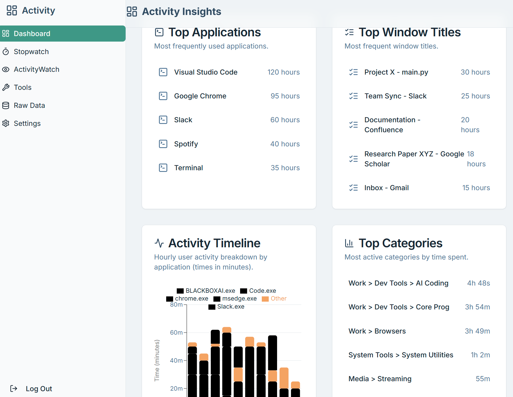
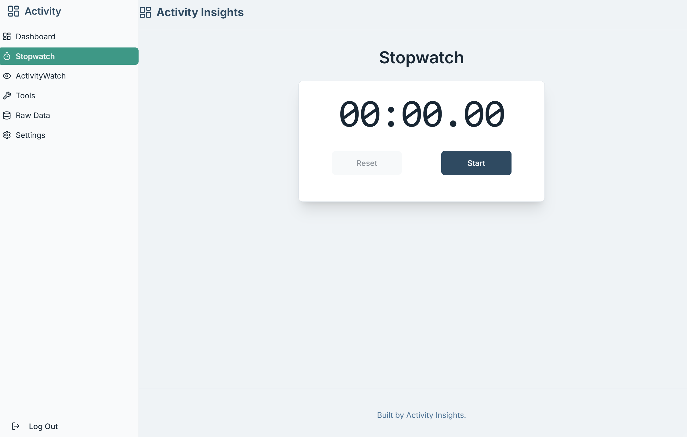

# Activity Insights
## Project Description

This project is an Activity Insights Dashboard that provides visualizations and insights into user activity data.



### Core Features:

- Activity Timeline: Displays a timeline chart of user activity over time.
- Top Activities: Shows lists of Top Applications and Window Titles used.
- Category Sunburst: Visualizes activity categories using a sunburst chart.

## Prerequisites

- Node.js (version 16 or higher recommended)
- npm (comes with Node.js) or yarn
- Firebase account and Firebase CLI installed (optional, for deployment)

## Installation

1. Clone the repository:

```bash
git clone <repository-url>
cd studio
```

2. Install dependencies:

```bash
npm install
# or
yarn install
```

## Running the Development Server

To start the development server, run:

```bash
npm run dev
# or
yarn dev
```

Open [http://localhost:3000](http://localhost:3000) in your browser to see the app.

## Project Structure

- `src/app/` - Main application pages and layouts
- `src/components/` - Reusable UI components, including dashboard and layout components
- `src/hooks/` - Custom React hooks used throughout the app
- `src/lib/` - Utility functions and libraries
- `docs/` - Project documentation and blueprints
- `public/` - Static assets (e.g., favicon)

## Building and Deployment

To build the project for production, run:

```bash
npm run build
# or
yarn build
```

To start the production server locally:

```bash
npm start
# or
yarn start
```

For deployment, you can use Firebase Hosting or any other platform that supports Next.js applications.

## Additional Documentation

See the [Blueprint Documentation](docs/blueprint.md) for detailed design and architecture information.

## Getting Started

To get started with development, check out the main page component at `src/app/page.tsx`.

---

## Project Roadmap

- Enhance data import and integration capabilities to support more data sources.
- Add user authentication and personalized dashboards.
- Implement advanced filtering and search options for activity data.
- Improve performance and scalability for large datasets.
- Add export options for reports and visualizations (PDF, CSV).
- Enhance mobile responsiveness and accessibility.
- Integrate real-time data updates and notifications.
- Expand visualization options with additional chart types.
- Improve documentation and add tutorials for new users.

## Current Limitations and Improvements Needed

- Limited data source integrations currently supported.
- No user authentication or personalized user settings.
- Filtering and search capabilities are basic and can be enhanced.
- Performance may degrade with very large datasets.
- Export and sharing features are not yet implemented.
- Mobile and accessibility support need further improvement.
- Real-time updates and notifications are not available.
- Visualization options are limited to a few chart types.
- Documentation can be expanded with more examples and tutorials.

If you have any questions or want to contribute, feel free to open an issue or submit a pull request.
